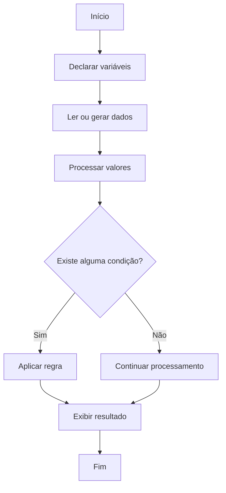

<div align="center">

# ☕ Desafios e Atividades em Java

Repositório de estudos com exercícios, atividades acadêmicas e pequenos programas desenvolvidos durante o aprendizado da linguagem Java.


</div>

---

## 📌 Sobre o repositório

Este repositório reúne exercícios e atividades desenvolvidos durante cursos, disciplinas acadêmicas e estudos independentes de Java.

Os códigos representam diferentes etapas da aprendizagem, desde programas introdutórios até exercícios com vetores, matrizes, cálculos, pesquisas, relatórios e regras de negócio simples.

O objetivo é:

* praticar a sintaxe da linguagem;
* desenvolver lógica de programação;
* registrar a evolução dos estudos;
* revisar conceitos;
* manter exemplos para consultas futuras;
* construir um portfólio acadêmico de exercícios.

> Os programas possuem finalidade educacional e podem apresentar soluções iniciais que serão refatoradas conforme a evolução técnica.

---

## 🧠 Conteúdos praticados

### Fundamentos

* estrutura de um programa Java;
* classe principal;
* método `main`;
* variáveis;
* constantes;
* tipos primitivos;
* operadores;
* conversões;
* saída com `System.out`;
* entrada com `Scanner`.

### Estruturas de controle

* `if`;
* `else`;
* `switch`;
* `for`;
* `while`;
* operadores relacionais;
* operadores lógicos.

### Estruturas de dados

* arrays;
* vetores;
* armazenamento de valores;
* percursos;
* busca;
* contagem;
* comparação;
* cálculos com elementos.

### Outros conceitos

* números aleatórios;
* porcentagens;
* médias;
* formatação de resultados;
* validações básicas;
* geração de relatórios;
* organização em classes e pacotes.

---

## 📂 Organização atual

Os exercícios estão separados principalmente pela instituição, curso ou origem do conteúdo.

```text
Atividades_em_Java/
│
├── src/
│   ├── DIO/
│   │   ├── DIO_Exercicio1.java
│   │   ├── DIO_Exercicio2.java
│   │   ├── DIO_Exercicio3.java
│   │   ├── DIO_Exercicio4.java
│   │   ├── DIO_Exercicio6.java
│   │   └── DIO_Exercicio7.java
│   │
│   ├── Estácio/
│   │   ├── Main.java
│   │   ├── Informa_Idade.java
│   │   ├── Velocidade.java
│   │   ├── Calculo_Area_Triangulo.java
│   │   └── Conceito.java
│   │
│   ├── IFS/
│   │   ├── P1/
│   │   └── Monitoria/
│   │
│   ├── Javanauta/
│   │   ├── EntradaSaidaDeDados.java
│   │   ├── OperadoresAritmeticos.java
│   │   ├── OperadoresLogicos.java
│   │   ├── IfElse.java
│   │   ├── SwitchCase.java
│   │   └── Wilhe.java
│     
└── README.md
```

---

## 🏫 Origem das atividades

| Diretório             | Conteúdo                                                                 |
| --------------------- | ------------------------------------------------------------------------ |
| `DIO`                 | Exercícios desenvolvidos em cursos e formações da Digital Innovation One |
| `Estácio`             | Atividades acadêmicas realizadas durante a graduação                     |
| `IFS`                 | Listas, avaliações e exercícios do Instituto Federal de Sergipe          |
| `Javanauta`           | Exercícios introdutórios de sintaxe e lógica                             |

---

## 🧩 Exemplos de exercícios

### Entrada de dados

Um dos exercícios solicita o nome e o ano de nascimento do usuário para calcular sua idade aproximada.

Conceitos praticados:

* `Scanner`;
* `String`;
* números inteiros;
* entrada e saída;
* formatação com `printf`.

Exemplo conceitual:

```java
Scanner scanner = new Scanner(System.in);

System.out.print("Informe seu nome: ");
String nome = scanner.nextLine();

System.out.print("Informe seu ano de nascimento: ");
int anoNascimento = scanner.nextInt();

int idade = 2026 - anoNascimento;

System.out.printf(
    "Olá, %s! Você tem aproximadamente %d anos.%n",
    nome,
    idade
);
```

---

### Tipos primitivos

Os exercícios introdutórios também trabalham tipos como:

```java
int idade = 25;
double salario = 3500.50;
char genero = 'M';
boolean empregado = true;
```

Esses exemplos ajudam a compreender:

* declaração;
* inicialização;
* armazenamento;
* exibição de valores.

---

### Vetores e análise de dados

Uma das atividades do IFS utiliza dois vetores para representar velocidades registradas durante uma viagem de ida e volta.

O programa:

* gera velocidades aleatórias;
* armazena dez valores em cada vetor;
* identifica velocidades consecutivas iguais;
* calcula multas;
* compara os registros de ida e volta;
* apresenta um relatório.

A lógica envolve:

```text
Velocidade permitida: 80 km/h

Até 20% acima:
multa de R$ 100,00

Acima de 20%:
multa de R$ 300,00
```

---

## 🔄 Fluxo típico dos exercícios



---

## 🛠️ Tecnologias e ferramentas

| Tecnologia           | Aplicação                     |
| -------------------- | ----------------------------- |
| Java                 | Linguagem principal           |
| JDK                  | Compilação e execução         |
| IntelliJ IDEA        | Ambiente de desenvolvimento   |
| Git                  | Controle de versão            |
| GitHub               | Armazenamento dos exercícios  |
| Scanner              | Entrada de dados              |
| Random e Math.random | Geração de valores aleatórios |

---

## 🚀 Como executar

### Pré-requisitos

É necessário possuir:

* Java Development Kit — JDK;
* Git;
* terminal ou uma IDE Java.

Verifique a instalação:

```bash
java --version
```

Verifique o compilador:

```bash
javac --version
```

---

### Clone o repositório

```bash
git clone https://github.com/ONestoDev/Atividades_em_Java.git
```

Acesse a pasta:

```bash
cd Atividades_em_Java
```

---

### Executar pela IDE

No IntelliJ IDEA:

1. abra o repositório;
2. marque `src` como diretório de código-fonte, se necessário;
3. abra a classe desejada;
4. execute o método `main`.

---

### Executar pelo terminal

Considere uma classe do pacote `DIO`.

Compile a partir da raiz:

```bash
javac -d out src/DIO/DIO_Exercicio1.java
```

Execute:

```bash
java -cp out DIO.DIO_Exercicio1
```

O parâmetro:

```text
-d out
```

instrui o compilador a criar a estrutura dos pacotes dentro da pasta `out`.

---

## ⚙️ Compilação com avisos

Para visualizar mais avisos do compilador:

```bash
javac -Xlint:all -d out src/DIO/DIO_Exercicio1.java
```

Isso pode ajudar a identificar:

* recursos obsoletos;
* conversões inseguras;
* problemas com tipos;
* usos inadequados de APIs;
* avisos de compilação.

---

## ✅ Pontos fortes

O repositório demonstra prática contínua com:

* sintaxe Java;
* entrada de dados;
* operadores;
* condicionais;
* repetições;
* vetores;
* cálculos;
* relatórios;
* organização em pacotes;
* resolução de problemas acadêmicos.

A quantidade de exercícios e o histórico de atualizações mostram continuidade nos estudos.

---

## ⚠️ Limitações atuais

O repositório ainda possui alguns pontos que podem ser melhorados:

* README pouco detalhado;
* nomes de arquivos inconsistentes;
* diretórios com acentos;
* pacotes nem sempre alinhados com as pastas;
* ausência de ferramenta de build;
* ausência de testes automatizados;
* ausência de instruções específicas por atividade;
* código frontend misturado ao conteúdo Java;
* concentração de toda a lógica em métodos `main`;
* datas e valores fixos em alguns exercícios.

---

## 🗺️ Melhorias futuras

* reorganizar exercícios por assunto;
* manter uma separação por instituição;
* padronizar nomes;
* remover acentos dos diretórios;
* adicionar descrição dos exercícios;
* criar arquivos README por módulo;
* corrigir pacotes;
* fechar objetos `Scanner`;
* extrair regras para métodos;
* criar testes;
* adicionar Maven ou Gradle;
* criar `.gitignore`;
* mover a EcoTrip para um repositório próprio;
* utilizar commits mais descritivos.

---

## 📁 Estrutura recomendada

Uma organização mais escalável seria:

```text
Atividades_em_Java/
│
├── src/
│   ├── main/
│   │   └── java/
│   │       └── br/
│   │           └── com/
│   │               └── onestodev/
│   │                   ├── fundamentos/
│   │                   ├── condicionais/
│   │                   ├── repeticao/
│   │                   ├── vetores/
│   │                   ├── matrizes/
│   │                   └── projetos/
│   │
│   └── test/
│       └── java/
│
├── docs/
│   └── indice-de-exercicios.md
│
├── .gitignore
├── pom.xml
└── README.md
```

Para preservar a origem acadêmica, os exercícios também podem usar subpacotes:

```text
fundamentos/dio/
fundamentos/estacio/
vetores/ifs/
```

---

## 🧪 Testes recomendados

| Cenário                    | Resultado esperado               |
| -------------------------- | -------------------------------- |
| Entrada numérica válida    | Programa executado normalmente   |
| Texto em campo numérico    | Erro tratado ou nova solicitação |
| Vetor vazio                | Mensagem adequada                |
| Valor negativo inválido    | Entrada rejeitada                |
| Limite exato de velocidade | Sem multa                        |
| Velocidade acima do limite | Multa correta                    |
| Ano de nascimento futuro   | Entrada rejeitada                |
| Divisão por zero           | Operação bloqueada               |

---

## 📚 Aprendizados desenvolvidos

Durante as atividades foram praticados:

* lógica de programação;
* sintaxe Java;
* tipos primitivos;
* strings;
* operadores;
* entrada e saída;
* estruturas condicionais;
* laços;
* vetores;
* números aleatórios;
* cálculos;
* classes;
* pacotes;
* depuração;
* controle de versão.

---

## 🎓 Contexto educacional

Os códigos foram produzidos durante atividades acadêmicas, cursos e estudos relacionados à linguagem Java.

O repositório representa a evolução prática nos fundamentos da programação e funciona como base para projetos mais estruturados no futuro.

---

## 👨‍💻 Autor

Desenvolvido por **Ernesto — ONestoDev**.

[](https://github.com/ONestoDev)

---

## 📄 Licença

Este repositório possui finalidade educacional.

Adicione um arquivo `LICENSE` para esclarecer as condições de uso, modificação e distribuição.
